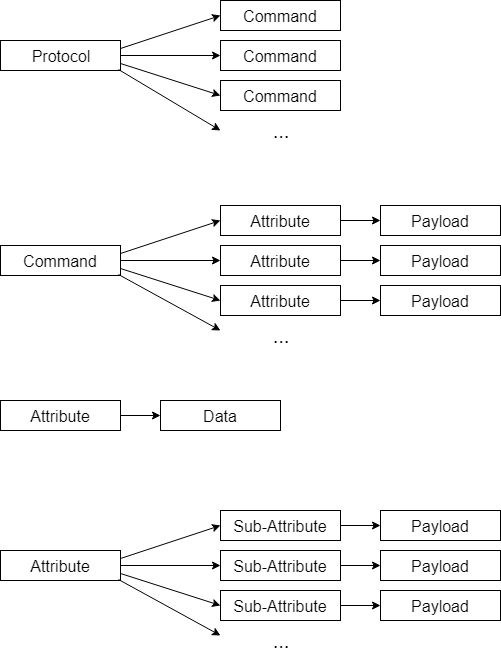
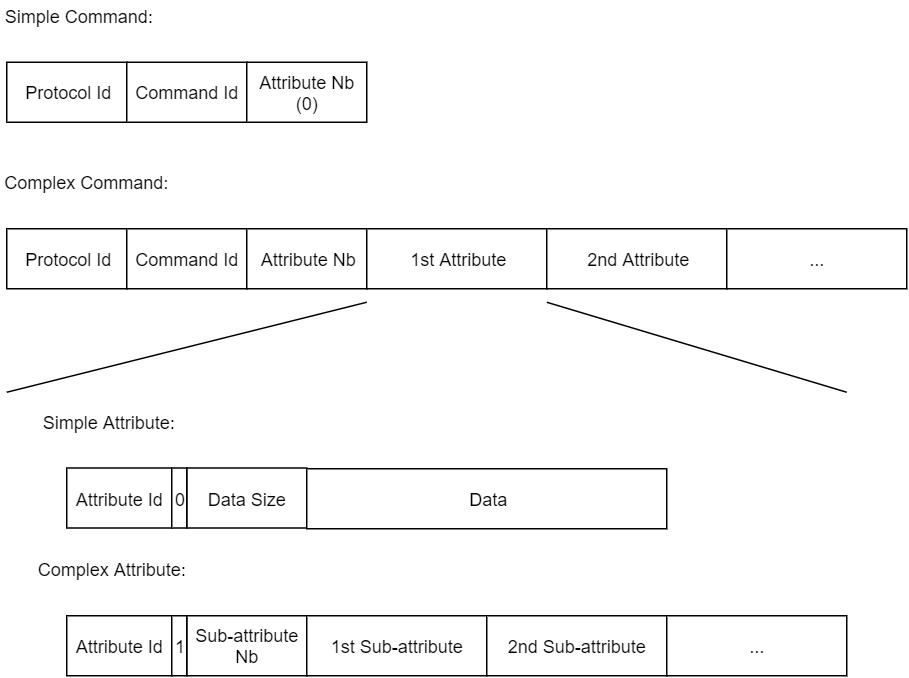

## What is LCSF

LCSF is two things:
1. A clever way to describe command sets in order to fit most applications, even complex ones.
2. A lightweight format to represent those command sets.

It was mainly conceived with IOT/M2M applications in mind where communication channels are heavily restricted in volume and speed.

LCSF and its environment are conceived in a way to automate repetitive tasks (protocol format deployment) so that you can focus on what the protocol actually does.

## When to use LCSF

A typical use case of LCSF is when you're developping an application where distant systems with limited ressources need to automatically exchange data (send order, retrieve sensor measurements, status reports...).
They will do so, using a custom set of commands and responses (called a command set) that structures the information to exchange.

LCSF provides you with a method to define the command set, and represent it in a way to minimise its size footprint.

## LCSF Command Set Description

A command set in LCSF is called a protocol and is the top hierarchical object.
A protocol is composed of a number of commands.

### Command Type

There are two types of commands:
* Simple commands, that are enough by themselves (e.g. ping, acknowledge, reset, abort...).
* Complex commands, that contain a data payload (e.g. a jump command that contains the jump address in its payload).

### Command Payload

The command payload is a list of attributes (e.g. a send file command will contain, at least, a file size attribute and a file data attribute).
Since attributes are here to structure the command payload, all attributes must have a data payload, otherwise they don't have a reason to exist.

### Command Direction

Your protocol might have a notion of master and slave or in more generic terms, a protocol asymmetry where there are two different point of views.

The way it is handled in LCSF is that you simply give each command a "direction":
* (A -> B): A can only send the command, B can only receive it.
* (B -> A): B can only send the command, A can only receive it.
* (A <-> B) / Bidirectional: Both A and B can receive and send the command.

### Attribute Type

There are also two types of attributes:
* Simple attributes, that have data payload (e.g. a jump address attribute that contains the address itself).
* Complex attributes, that have a list of sub-attributes payload to describe more complex objects (e.g. a colorspace attribute that will contain as sub-attributes its type (RGB, YUV, HSL...) and its three components).

### Sub-attribute

Sub-attributes are attributes in their own right. This means that if you have a type of data (e.g. an address) sent both in a command attribute and a sub-attribute, you really need to create one attribute "Address" in your protocol and use it for both cases.

Note than sub-attributes can have their own sub-attributes. As such, there is no limit to the amount of attribute branching/nesting you can do.
This is one of the key feature of LCSF and gives it the flexibility to describe most, if not all, command sets that you may need to create for your applications.

### Optional Attribute

Attributes have a mandatory payload but there are cases where an attribute won't be always there (e.g. a wait command may have a waiting time attribute or a default value if no time is given).

To avoid sending useless data, attributes can be set as optional, otherwise they're mandatory.

### Attribute Data Type

Simple attributes are given a data type to their payload. The different data types are:
* `(u)int8`
* `(u)int16`
* `(u)int32`
* `String`
* `Byte Array`

All the number types have fixed sizes of respectively (1, 2 and 4 bytes).
Strings must be null-terminated, therefore their sizes are implicit.

### Command Sequence

Protocols don't have an intrinsic notion of sequences. They must be handled at the application level, using a state machine or something similar.

### Good Practice

Creating your protocol and defining the different commands and attributes is not trivial and there is many ways to do one thing. This is why we propose the following good practices:

* As a good practice, to respect strict self-containment of protocol layers, if you have an attribute type of undetermined size like byte array (e.g. a file data attribute), you must accompany it with a size attribute (e.g. a `uint32` file size attribute).
One exception of this would be if you have fixed length array in your protocol (e.g. a sha1 digest will always be 20 bytes) as the attribute itself will imply the size of the array.
* An attribute can only appear once in a command or as a sub-attribute. Therefore, if you need to send multiple similar pieces of data, you should consider using an array attribute to regroup them.

### Wrapping-up

The following diagram sums up how a command set is structured:

## LCSF Formatting

As to how LCSF protocols are represented we need to distinguish two things:
* The protocol description, that represents all the commands and attributes that can be exchanged.
* A protocol message, that is the unit of data that will be transfered between a sender and a receiver. It will contains only one command and its attributes, if the command has any.

### Protocol Description

The description format is language-dependent and will vary, but it will be based around arrays of structures, detailing the commands and their attributes.

### Format Endianness

The format is little endian.

### Identifier Space

Protocols, commands and attributes have separate identifiers spaces as they are considered different objects. There is no problem with a command and an attribute having the same identifier.

That is not the case for attributes and sub-attributes, you must make sure that different (sub-)attributes have different identifiers.

### Protocol Message

The message structure is defined as:
* Protocol id: The user-defined protocol identifier. One id value (usually `~0`) is reserved for the built-in lcsf error protocol.
* Command id: The user-defined command identifier of the command being sent.
* 1st Attribute id: The user-defined identifier of one of the command attributes.
* Complexity flag: Flag value is 0 if payload is data, 1 if sub-attributes.
* Payload size: Either the data size or the number of sub attributes, depending on complexity flag.
* Attribute payload.
* 2nd Attribute id.
* ...

Simple Attribute structure:
* Attribute id
* Complexity flag
* Data size
* Data payload

Complex Attribute structure:
* Attribute id
* Complexity flag
* Sub-attributes number
  * 1st sub-attribute id
  * Complexity flag
  * Payload size
  * Sub-attribute payload
  * 2nd sub-attribute id
  * ...

### Wrapping-up

The following diagram sums up how a message is formatted:

### Standard representation

Below are the standard sizes for the different message components:
* Protocol id: 16 bits, `0xFFFF` reserved for lcsf error protocol.
* Command id: 16 bits.
* Attribute id: 15 bits.
* Complexity flag. 1 bit.
* Payload size: 16 bits.
* Data payload: User defined.

If this representation doesn't suit your application, you can make a custom one.
In the future, other representations may be supported by the LCSF environment.

### Protocol Versioning

You might run in a case where different systems will use different versions of the same protocol. If the different versions have the same identifier, it might lead to errors as one of the system might use a newer command that the other system doesn't understand.

A simple way to avoid this issue is to change the protocol identifier each time the protocol is changed after initial deployment (e.g. using one byte for the version number).

## LCSF Error Protocol

LCSF has a built-in error protocol to report problems encountered while processing incoming LCSF messages back to the sender.

The protocol id is `0xFFFF` (standard representation). It has only one command "Error" with two mandatory attributes "Error location" and "Error type".
* Error location indicates if the message has bad formatting or if it doesn't correspond to its protocol description
* Error type gives more information on the error nature

The tables below describe the protocol in more details.

Command description table:

| Command Name | Command Id  | Direction | Attributes (mandatory)       | Attributes (optional) | Description  |
|:-------------|:------------|:----------|:-----------------------------|:----------------------|:-------------|
| `Error`      |  `0x00`     | `A <-> B` | `Error_Location, Error_Type` | `/`                   | Indicates an error occurred when decoding a LCSF message |

Attribute description table:

| Attribute        | Attribute Id | Data Type | Description |
|:-----------------|:-------------|:----------|:------------|
| `Error_Location` | `0x00`       | `uint8`   | Enum describing the error location (bad formatting or protocol issue) |
| `Error_Type`     | `0x01`       | `uint8`   | Enum describing the type of error |

Error_Location enum table:

| Enum name          | Enum Value | Description |
|:-------------------|:-----------|:------------|
| `DECODE_ERROR`     | `0x00`     | Error happened while decoding (formatting error) |
| `VALIDATION_ERROR` | `0x01`     | Error happened while validating (protocol error) |

Error_Type enum table if decode error:

| Enum name        | Enum Value | Description |
|:-----------------|:-----------|:------------|
| `FORMAT_ERROR`   | `0x00`     | Message format error, missing or leftover bytes |
| `OVERFLOW_ERROR` | `0x01`     | Message is too big to be processed |
| `UNKNOWN_ERROR`  | `0xFF`     | Unspecified error |

Error_Type enum table if validation error:

| Enum name              | Enum Value | Description |
|:-----------------------|:-----------|:------------|
| `UNKNOWN_PROTOCOL_ID`  | `0x00`     | Unrecognised protocol id |
| `UNKNOWN_COMMAND_ID`   | `0x01`     | Unrecognised command id |
| `UNKNOWN_ATTRIBUTE_ID` | `0x02`     | Unrecognised attribute id |
| `TOO_MANY_ATTRIBUTES`  | `0x03`     | More attributes received than expected |
| `MISSING_NON_OPTIONAL` | `0x04`     | A non optional attribute is missing |
| `WRONG_DATA_TYPE`      | `0x05`     | Attribute data is of wrong type/size |
| `UNKNOWN_ERROR`        | `0xFF`     | Unspecified error |

## LCSF Environment

The LCSF environment is composed of:
* [LCSF C Stack](https://github.com/jean-roland/LCSF_C_Stack): A LCSF implementation written in C, aimed at small embedded systems - bare metal friendly, static memory allocation, small footprint <3kB data, ram consumption depends on user parameters (typical 1kB)
* [LCSF Generator](https://github.com/jean-roland/LCSF_Generator): A C++/Qt graphic tool used to create, edit and deploy LCSF protocols. It generates code for the LCSF stack as well as documentation (wiki and markdown format).

For more information on these projects, check their respective documentation.